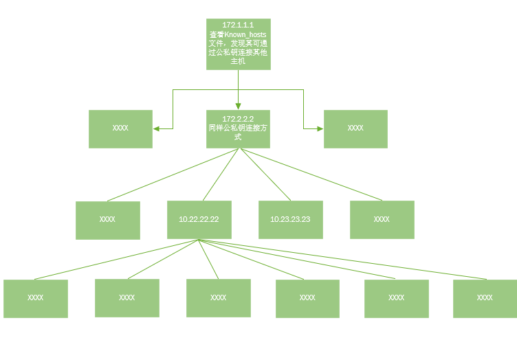

# SSH_Spider V1.0 #

**SSH_Spider** 是一个通过公私钥SSH批量登录IP，在每台登录主机执行命令，把执行的命令提取放到本地，若登录主机存在id_rsa和konwn_hosts文件，则再以登录主机为跳板，继续SSH连接下一层的小工具

### 使用前提 ###

```
Linux主机存在id_rsa和known_hosts文件
```

### 使用场景 ###

```
1：企业内部安全自查公私钥配置情况
2：攻防演练拿下某点时，通过该工具批量拿下内网Linux主机
```

### Install ###

```
python -m pip install -r requirements.txt
```

### 开始使用 ###

```
1：id_rsa放入主机私钥
2：server_list.txt放入konwn_hosts文件处理后的IP
3：python SSH_Spider.py
```

### 原理 ###



### 扫描结果 ###


### 结果文件 ###


